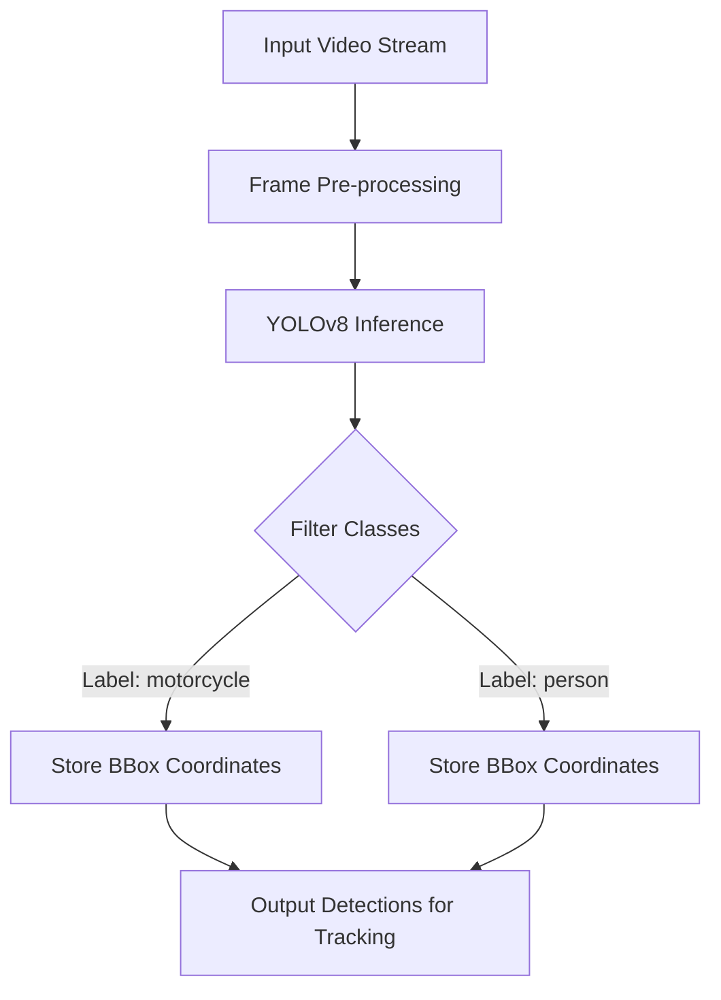
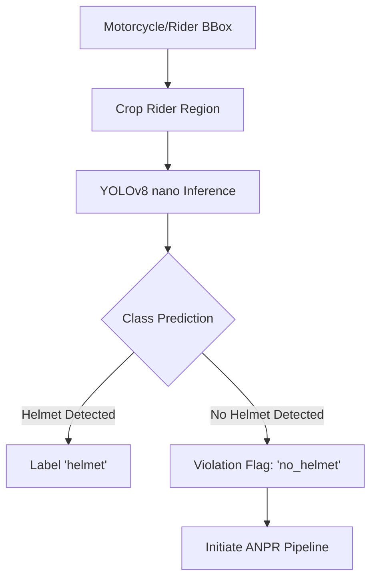
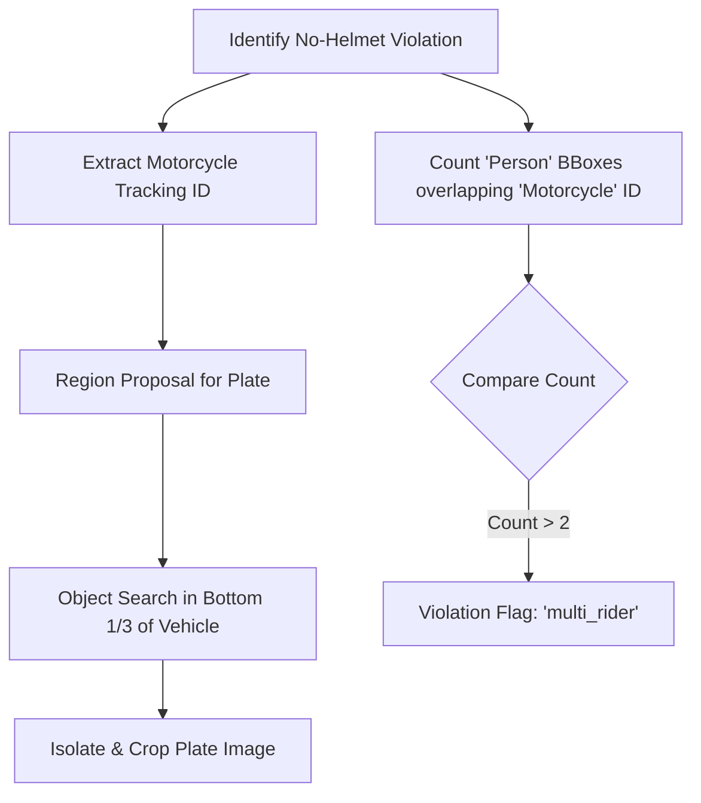
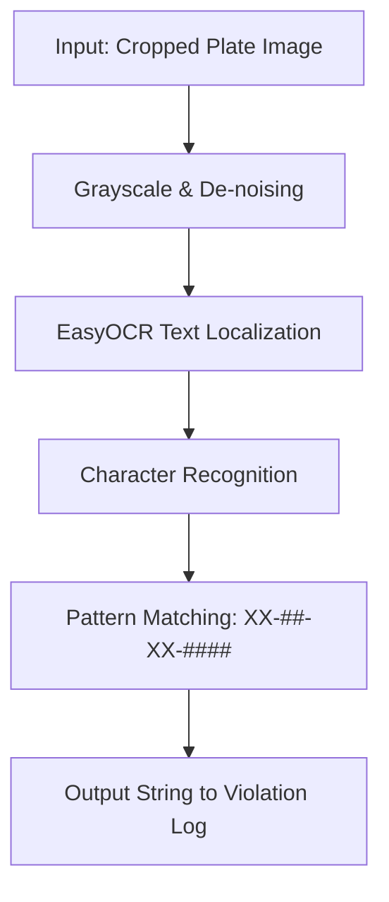
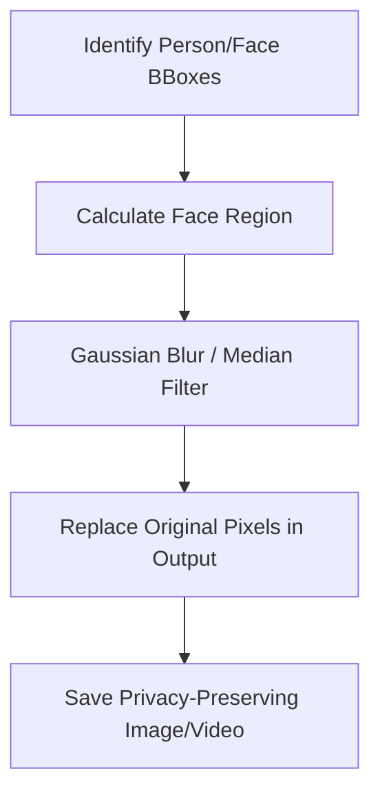
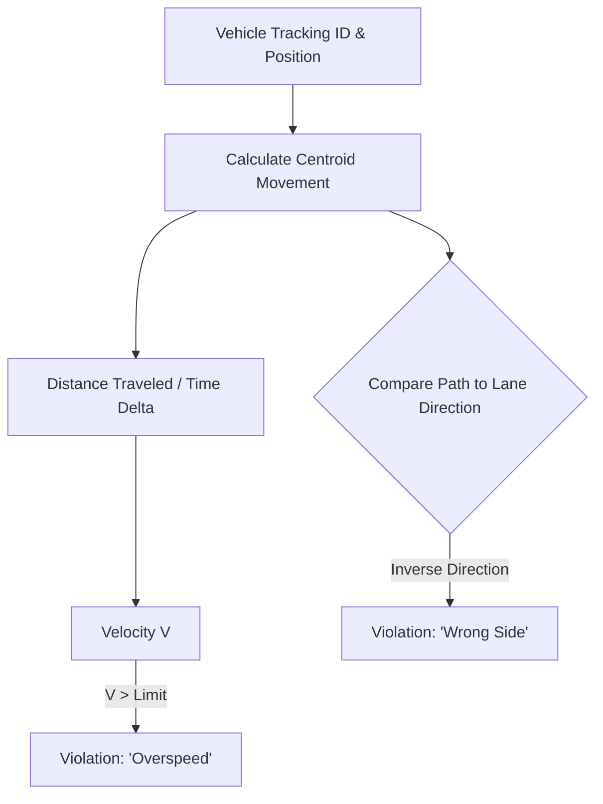

# Traffic AI System: Evaluation Metrics & Flowcharts

This document outlines the evaluation strategy and logical flow for each of the six core objectives of the project.

---

## 1. Motorcycle and Rider Detection
**Objective:** Detect motorcycles and riders using deep learning.

### Flowchart

### Evaluation Metrics
- **mAP@.50:** Primary metric for detection accuracy.
- **Precision:** Percentage of correctly identified detections.
- **Recall:** Percentage of actual objects successfully detected.
- **FPS (Frames Per Second):** Performance benchmark for real-time viability.

---

## 2. Helmet Usage Identification
**Objective:** Detect non-helmet riders using YOLOv8 nano.

### Flowchart

### Evaluation Metrics
- **F1-Score:** Balanced accuracy of helmet vs. non-helmet classification.
- **Confusion Matrix:** Specifically monitoring False Positives (helmet misidentified as violation).
- **Classification Accuracy:** Overall percentage of correct labels on cropped images.

---

## 3. Plate Cropping & Rider Counting
**Objective:** Crop numbers plates and count riders on motorcycles.

### Flowchart

### Evaluation Metrics
- **Localization IoU:** How accurately the plate was cropped (Overlap with ground truth).
- **Counting Error Rate:** Number of multi-rider detections missed or incorrectly counted.
- **Successful Cropping Rate:** Percentage of violations where a clear plate crop was extracted.

---

## 4. Optical Character Recognition (EasyOCR)
**Objective:** Read and extract plate info from violators.

### Flowchart

### Evaluation Metrics
- **Character Accuracy:** Accuracy of individual character recognition.
- **Plate Accuracy:** Percentage of plates where every character is correct.
- **Processing Time:** Latency added by the EasyOCR engine.

---

## 5. Privacy Preservation (Face Blurring)
**Objective:** Ensure privacy via automatic face blurring.

### Flowchart

### Evaluation Metrics
- **Anonymization Success:** Subjective/Machine check if faces are identifiable.
- **Face Detection Recall:** Percentage of faces caught before output generation.
- **Pixelation/Blur Efficiency:** Ensuring the blur is localized and doesn't obscure violation evidence.

---

## 6. Speed & Lane Violation Detection
**Objective:** Detect overspeeding and wrong-way driving.

### Flowchart

### Evaluation Metrics
- **Speed Precision (± km/h):** Variation from actual ground-truth speed.
- **Lane Detection Accuracy:** Percentage of correct wrong-side driving flags.
- **Tracking ID Continuity:** Ability to keep the same vehicle ID during lane changes.
